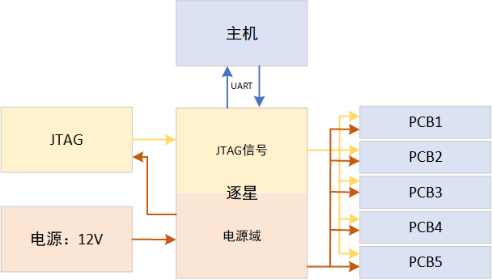

# 逐星：使用一个JTAG调试多个PCB板

## 逐星——硬件部署架构图：

## 逐星——工作原理：

### 基础原理：

逐星通过控制`JTAG`和`PCB板`的电源开断，来指定`某个PCB`与`JTAG`的信号连接。

### 详细实现：

1. 向逐星提供`12V`直流电源，逐星会产生`12V`、`8V`、`5V`、`3.3V`等三种电压等级的直流电源。
2. 逐星将`3.3V`电源提供给`JTAG`作为信号电压，8V电源提供给`JTAG`作为其工作电源。
3. 逐星将`12V`电源提供给`PCB1`、`PCB2`、`PCB3`、`PCB4`、`PCB5`作为其工作电源。
4. 逐星提供给`JTAG`和`PCB*`的电源，均可以通过向逐星发送指定命令，控制是否供电。
5. `JTAG`可以调试`PCB板`，需要一个前置条件，即：`PCB板`向`JTAG`提供`3.3V`信号电源。注：PCB板内部也会有3.3V电源产生。
6. 因此，无需控制`PCB板`是否与`JTAG`的`3.3V`信号线的开断，仅需保证`PCB板`的`3.3V`与`JTAG`的`3.3V`共地，同电压即可。
7. 当逐星稳定给`JTAG`提供`3.3V`的信号电源时，仅需逐星决定是否向`PCB*`供电，即可完成`PCB*`与`JTAG`的连接。

## 逐星——控制指令：

1. `JTAG_ON`：向`JTAG`提供`3.3V`电源
2. `JTAG_OFF`：不向`JTAG`提供`3.3V`信号电源
3. `JTAG_POWER_ON`：向`JTAG`提供`8V`工作电源
4. `JTAG_POWER_OFF`：不向`JTAG`提供`8V`工作电源
5. `PCB1_POWER_ON`：向`PCB1`提供`12V`工作电源
6. `PCB1_POWER_OFF`：不向`PCB1`提供`12V`工作电源
7. `PCB2_POWER_ON`：向`PCB2`提供`12V`工作电源
8. `PCB2_POWER_OFF`：不向`PCB2`提供`12V`工作电源
9. `PCB3_POWER_ON`：向`PCB3`提供`12V`工作电源
10. `PCB3_POWER_OFF`：不向`PCB3`提供`12V`工作电源
11. `PCB4_POWER_ON`：向`PCB4`提供`12V`工作电源
12. `PCB4_POWER_OFF`：不向`PCB4`提供`12V`工作电源
13. `PCB5_POWER_ON`：向`PCB5`提供`12V`工作电源
14. `PCB5_POWER_OFF`：不向`PCB5`提供`12V`工作电源
15. 推荐指令：**`JTAG_ONLY_CONNECT_PCB1`：仅将`PCB1`与`JTAG`连接，支持调试`PCB1`**
16. 推荐指令：**`JTAG_ONLY_CONNECT_PCB2`：仅将`PCB2`与`JTAG`连接，支持调试`PCB2`**
17. 推荐指令：**`JTAG_ONLY_CONNECT_PCB3`：仅将`PCB3`与`JTAG`连接，支持调试`PCB3`**
18. 推荐指令：**`JTAG_ONLY_CONNECT_PCB4`：仅将`PCB4`与`JTAG`连接，支持调试`PCB4`**
19. 推荐指令：**`JTAG_ONLY_CONNECT_PCB5`：仅将`PCB5`与`JTAG`连接，支持调试`PCB5`**
20. 推荐指令：**`JTAG_CONNECT_LIST`：查询当前JTAG与哪个PCB连接**

